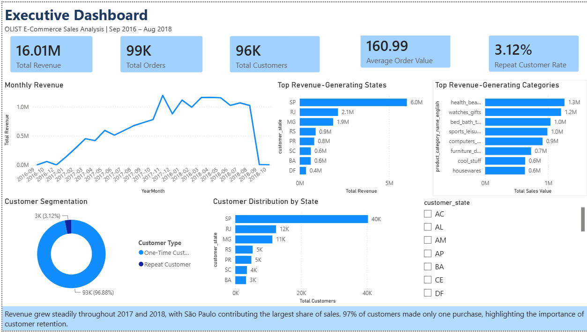
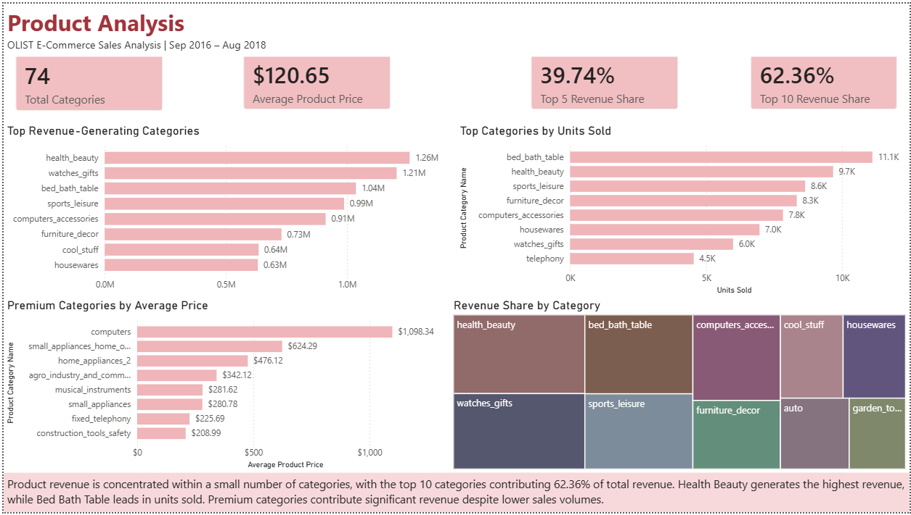
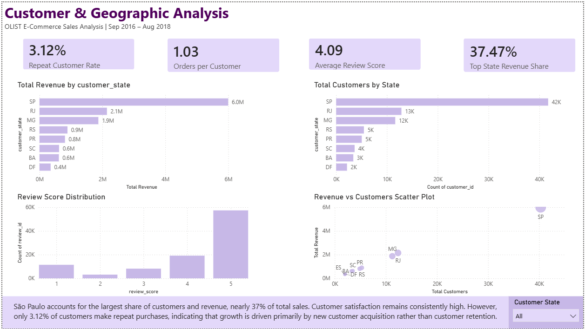

# Brazilian E-Commerce Analysis (Olist)

## Project Overview

This project analyzes the Brazilian E-Commerce Public Dataset by Olist to uncover trends in sales performance, customer behavior, product demand.

Using **Python** for data preparation and exploratory analysis and **Power BI** for interactive dashboard development, the project transforms raw data into actionable business insights.

### Business Questions Addressed

- Which product categories generate the highest revenue?
- Which categories sell the highest volume?
- How concentrated is revenue across products?
- Which states contribute the most revenue and customers?
- How satisfied are customers?
- How frequently do customers make repeat purchases?

---

## Tools & Technologies

- Power BI
- Power Query
- DAX
- Python
- Pandas
- NumPy
- Matplotlib
- Jupyter Notebook

---

## 📈 Dashboard Pages

### Executive Dashboard
Provides an overview of revenue, orders, customer growth, and overall business performance.

### Product Analysis
Examines product category performance, revenue contribution, sales volume, and pricing patterns.

### Customer & Geographic Analysis
Analyzes customer behavior, review scores, repeat purchases, and regional revenue distribution.

---

## 📷 Dashboard Preview

### Executive Dashboard



### Product Analysis



### Customer & Geographic Analysis



---

## Key Findings

### Sales Analysis

- Revenue grew steadily throughout 2017 and 2018.
- November 2017 recorded the highest revenue and order volume.
- Average Order Value remained relatively stable over time.
- Revenue was concentrated among a relatively small number of products and regions.

### Product Analysis

- **Health Beauty** generated the highest revenue.
- **Bed Bath Table** recorded the highest sales volume.
- Premium-priced categories generated strong revenue despite lower sales volumes.
- The top 10 categories contributed over **62% of total revenue**.

### Customer Analysis

- Customers reported high satisfaction, with an average review score of **4.09/5**.
- Only **3.12%** of customers made repeat purchases.
- Average orders per customer were approximately **1.03**, indicating growth relies heavily on acquiring new customers.

### Geographic Analysis

- **São Paulo** generated nearly **37% of total revenue** and had the largest customer base.
- Revenue and customer activity were heavily concentrated in the Southeast region.
- The top three states contributed approximately **64% of total revenue**.
- States with larger customer populations generally generated higher revenue.

---

## Business Recommendations

- Strengthen customer retention through loyalty programs and personalized marketing.
- Continue investing in high-performing categories such as Health Beauty and Bed Bath Table.
- Expand into emerging regions to reduce geographic revenue concentration.
- Leverage strong customer satisfaction to drive repeat purchases.
- Diversify marketing efforts beyond the top-performing states to support long-term growth.

---

## Skills Demonstrated

### Data Preparation & Modeling

- Data Cleaning
- Data Modeling
- Power Query Transformations

### Data Analysis

- Exploratory Data Analysis (EDA)
- KPI Development
- DAX Measures
- Customer Analytics
- Product Analytics

### Visualization & Reporting

- Dashboard Design
- Data Visualization
- Business Insight Generation

---

## Repository Structure

```text
olist-ecommerce-sales-analysis
│
├── data
│   └── dataset_link.txt
│
├── notebooks
│   └── EDA.ipynb
│
├── images
│   ├── executive_dashboard.png
│   ├── product_analysis.png
│   └── customer_geographic_analysis.png
│
├── requirements.txt
└── README.md
```

---

## Dataset

Dataset Source:

https://www.kaggle.com/datasets/olistbr/brazilian-ecommerce

The dataset includes:

- Customers
- Orders
- Order Items
- Payments
- Products
- Sellers
- Reviews
- Geolocation Data
- Product Category Translation

---

## Project Outcome

This project demonstrates an end-to-end Business Intelligence workflow, from data preparation and exploratory analysis in Python to interactive dashboard development in Power BI and communication of actionable business insights.

---

## Author

**Sanchi Sharma**

Aspiring Data Analyst | Power BI | Python | SQL
